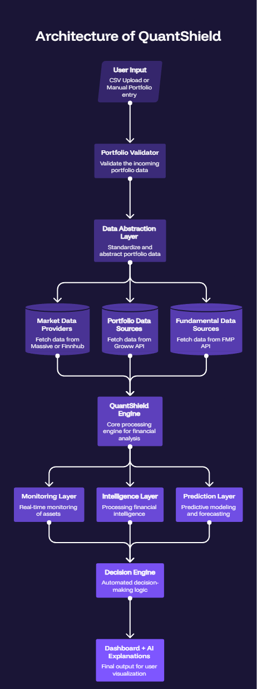

<div align="center">


<br/>


<br/><br/>


</div>

---

## 🎯 &nbsp; The Problem

Most portfolio analytics platforms answer one question:

> **What is my current risk?**

QuantShield answers four:

| Question | QuantShield Feature |
|---|---|
| 📊 *What is my risk?* | Real-time VaR, Volatility, Sharpe & Beta monitoring |
| 🔍 *Why is it changing?* | Correlation spike detection & root-cause attribution |
| 🔮 *What happens next?* | 30-day risk transition probability (Markov + ML) |
| ⚡ *What should I do?* | Diversification recommendations with impact estimates |

---

## 🏗️ &nbsp; System Architecture

<!-- 📌 REPLACE with your architecture diagram image -->
<!-- Upload image to your repo and update the path below -->

<div align="center">
  
  <br/>
  <sub>QuantShield 4-Layer Architecture — Monitoring → Intelligence → Foresight → Decision</sub>
</div>

<br/>

The system is structured across four layers:

```
┌─────────────────────────────────────────────────┐
│  Layer 4 — Decision Support                     │
│  Recommendations · Scenario Simulation          │
├─────────────────────────────────────────────────┤
│  Layer 3 — Forward Insight                      │
│  Risk Forecasting · Regime Prediction           │
├─────────────────────────────────────────────────┤
│  Layer 2 — Intelligence                         │
│  Root Cause Analysis · Risk Drift Detection     │
├─────────────────────────────────────────────────┤
│  Layer 1 — Monitoring                           │
│  VaR · Volatility · Sharpe · Beta · Drawdown    │
└─────────────────────────────────────────────────┘
```

---

## 🧠 &nbsp; Intelligence Pipeline

<!-- 📌 REPLACE with your intelligence pipeline image -->
<!-- Upload image to your repo and update the path below -->

<div align="center">
  
  <br/>
  <sub>From raw market data to actionable risk narrative</sub>
</div>

<br/>

The intelligence pipeline transforms raw financial data into human-readable insights:

```
Market Data → Feature Engineering → Risk Classification
     ↓                                      ↓
Correlation                         Regime Detection
Analysis                                    ↓
     ↓                             Transition Modeling
Root Cause                                  ↓
Attribution    →    LangChain/LangGraph Agents    →    Risk Narrative
```

**Agent roles:**
- **Analytics Interpreter** — reads and contextualizes risk metrics
- **Correlation Analyst** — identifies hidden risk linkages
- **Risk Narrator** — generates plain-English portfolio summaries

---

## 🔄 &nbsp; Data Flow

<!-- 📌 REPLACE with your data flow diagram image -->
<!-- Upload image to your repo and update the path below -->

<div align="center">
  
  <br/>
  <sub>Multi-source data ingestion and processing pipeline</sub>
</div>

<br/>

```
Polygon (Historical + Real-time)  ──┐
Finnhub (News + Streaming)         ├──→  Feature Store  →  ML Models
Groww API (NSE/BSE)                ├──→  Risk Engine    →  AI Agents
FMP (Fundamentals + Macro)        ──┘                   →  Dashboard
```

---

## 🧩 &nbsp; Risk Intelligence Framework

<!-- 📌 REPLACE with your risk intelligence framework image -->
<!-- Upload image to your repo and update the path below -->

<div align="center">
  
  <br/>
  <sub>How QuantShield connects risk signals to investor decisions</sub>
</div>

---

## 🤖 &nbsp; ML Architecture

<details>
<summary><b>Expand ML details</b></summary>
<br/>

| Objective | Models Used | Output |
|---|---|---|
| Risk Classification | Random Forest · XGBoost · LightGBM | `Low / Medium / High` |
| Regime Transitions | Hidden Markov Models · Gradient Boosting | Transition probabilities |
| Drawdown Probability | Sequence Models | % likelihood of >10% drawdown |
| Volatility Regime | Unsupervised clustering | Stable / Unstable |

> QuantShield predicts **portfolio risk behavior**, not stock prices or returns.

</details>

---

## 📊 &nbsp; Key Features

<details>
<summary><b>Risk Monitoring</b></summary>
<br/>

- Portfolio Volatility
- Value at Risk (VaR)
- Maximum Drawdown
- Sharpe & Sortino Ratio
- Beta, Concentration Risk, Sector Exposure

</details>

<details>
<summary><b>Risk Intelligence</b></summary>
<br/>

- **Risk Drift Detection** — spot gradual regime transitions before they become critical
- **Hidden Risk Detection** — correlation spikes, diversification breakdown, sector concentration
- **Risk Drift Signature** — root-cause attribution for risk changes

</details>

<details>
<summary><b>Scenario Simulation</b></summary>
<br/>

| Scenario | Input | Portfolio Impact |
|---|---|---|
| Market Crash | Market −10% | Portfolio −18% |
| Sector Shock | IT Sector −20% | Risk +25% |
| Rate Hike | Rates +1% | Volatility +12% |

</details>

---

## 📂 &nbsp; Portfolio Input

```csv
Ticker,Weight
RELIANCE.NS,20
TCS.NS,15
INFY.NS,10
```

Supports **CSV upload** and **manual portfolio builder**. Validates weights, tickers, duplicates, and missing values automatically.

---

## 🚀 &nbsp; Roadmap

- [ ] Enhanced Regime Detection Models
- [ ] Advanced Scenario Libraries
- [ ] Multi-Portfolio Monitoring
- [ ] AI Risk Copilot
- [ ] Portfolio Optimization Suggestions
- [ ] Interactive Risk Education Modules
- [ ] Institutional Risk Reporting

---

## 📜 &nbsp; Disclaimer

QuantShield is built for **educational, research, and portfolio risk analysis** purposes.

It does **not** provide financial advice, investment recommendations, or trading signals.

---

<div align="center">


<sub>Built by <a href="https://github.com/pratiklakra38">@pratiklakra38</a></sub>

</div>
